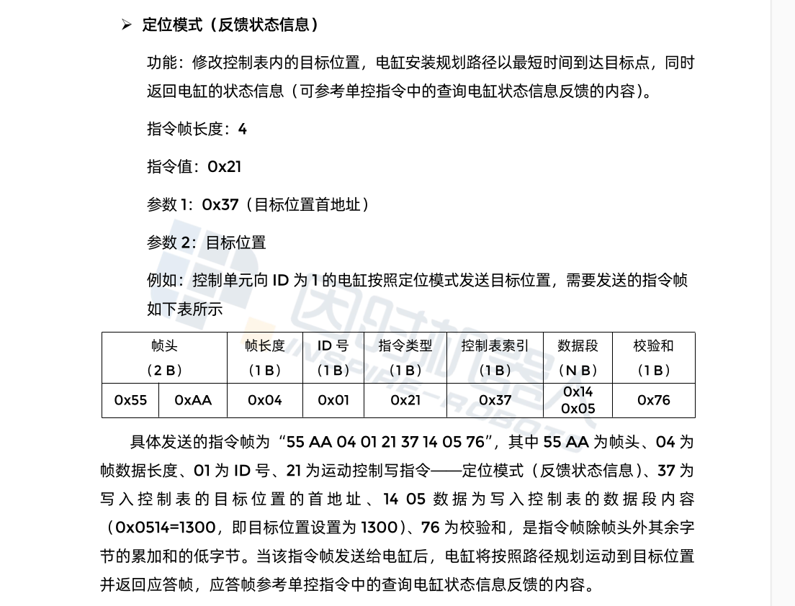

# 1. 电缸控制开发计划

通讯方式：`LVTTL-3.3V`   (USB转TTL  或者 RS232转TTL)

运动控制模式：随动模式（反馈状态信息）


| 内容                          | 完成日期   | 备注                                                         |
| ----------------------------- | ---------- | ------------------------------------------------------------ |
| 上位机指令下发、状态查询处理  | 2025/01/07 | 指令下发：打印通过HTTP获取的JSON格式的内容<br />状态查询： 手动封装JSON数据，返回。 |
| 利用节点控制电缸运动          | 2025/01/09 | 通过串口通讯，控制电缸运动                                   |
| 通过Postman发送运动、查询指令 | 2025/01/13 | 打印出通过串口发送到电机的指令                               |

**step one:** 上位机通过http发送json格式的控制指令

- 获取并解析成ROS2中的消息类型，将其发布到“motor_command”主题上

- 另起节点， 订阅“motor_command”主题的信息， 通过串口发送给Motor

	> 从topic获取的pose需要转换成因时电缸的控制指令

	


#  2. 准备工作

## 2.1 创建虚拟串口

### 1、安装 socat

如果还没有安装 `socat`，可以使用以下命令进行安装：

```bash
sudo apt update
sudo apt install socat
```

**1.创建虚拟串口对** 

使用 `socat` 创建虚拟串口对：

```bash
sudo socat -d -d pty,link=/dev/ttyV0,mode=777 pty,link=/dev/ttyV1,mode=777
```

- `pty` 表示伪终端（虚拟串口）。
- `link=/dev/ttyV0` 和 `link=/dev/ttyV1` 指定虚拟串口的名称。您可以根据需要自由命名。
- `mode=777` 给予文件读取和写入的权限（通常为开发和调试使用）。

此命令将创建两个虚拟串口 `/dev/ttyV0` 和 `/dev/ttyV1`，它们功能类似于真实串口。

**2.查看创建的虚拟串口** 

可以使用以下命令查看新创建的虚拟串口：

```bash
ls -l /dev/ttyV*
```

### 2. 使用虚拟串口进行通信

在大多数 Linux 发行版中，可以使用包管理器来安装 `minicom`。

```bash
sudo apt update
sudo apt install minicom
```

您可以使用 `minicom` 或其他串口通信程序来与虚拟串口进行交互。例如：

- 打开一个终端窗口，连接到第一个虚拟串口：

	```bash
	minicom -D /dev/ttyV0
	```

- 打开另一个终端窗口，连接到第二个虚拟串口：

	```bash
	minicom -D /dev/ttyV1
	```

在这两个终端窗口中，您可以在一个窗口中输入内容，而在另一个窗口中接收该内容，就像使用真实的串口一样。

### 3. 结束 `socat`

要停止 `socat` 进程，可以使用 `Ctrl + C` 来结束它。如果您希望在后台运行，可以使用以下命令：

```bash
socat -d -d pty,link=/dev/ttyV20,mode=777 pty,link=/dev/ttyV30,mode=777 &
```

然后使用 `jobs` 命令查找后台任务，并使用 `fg` 重新调回前台或使用 `kill` 命令停止它。


## 3. Demo运行

**1.创建虚拟串口**

```bash
sudo socat -d -d pty,link=/dev/ttyV20,mode=777 pty,link=/dev/ttyV30,mode=777
```

**2.使用虚拟串口进行通讯**

```bash
minicom -D /dev/ttyV20
```

**3.运行ROS节点**

```bash
ros2 run motor_control adapter_http
```

再打开一个终端

```bash
ros2 run motor_control send_motor_command
```


## 4. 电缸指令 



 “55AA04” +   01 (电缸的ID)   + “21 37” + 目标设定位置 +“76” 
